# Portfolio - Gerry Blanch

### This repo may not be kept up to date, better visit the **[Website version](https://gblanch.github.io/projects/)** I host on GitHub Pages

&nbsp;

<h2 id="core-competencies">Core Competencies</h2>
  <ul>
  <li><strong>Languages</strong>: Python, SQL </li>
  <li><strong>Methodologies</strong>: EDA, CRUD, Web Scraping, Statistical Methods, Probability, Machine Learning, Time Series Analysis </li>
  <li><strong>Tools</strong> 
  <ul>
  <li><strong>IDE</strong> : VS Code, Jupyter Notebook</li>
  <li><strong>Scripting</strong> : Shell, Bash</li>
  <li><strong>Version Control</strong> : Git, GitHub</li>
  <li><strong>DB Management</strong> : PostgreSQL, SQL Server, MongoDB </li>
  <li><strong>Visualization</strong> : PowerBI, Excel, Tableau </li>
  <li><strong>Cloud Resources</strong> 
  <ul>
  <li><strong>IaC</strong> : Terraform, CloudFormation </li>  
  <li><strong>PaaS</strong> : Render, Beanstalk</li>
  <li><strong>Computing</strong> : Compute Engine, EC2, RDS </li>
  <li><strong>Storage</strong> : Cloud Storage, S3 </li>
  <li><strong>Warehouse</strong> : BigQuery, Redshift</li>
  <li><strong>Analytics</strong> : Analytics/Looker Studio, Athena</li>
  </ul>
  </ul>
  </ul>

  <h2 id="projects">Projects</h2>
  

  <ul>
  <h3 id="data-analysis">Data <strong>Analysis</strong></h3>
 
  
<strong><a href="https://github.com/GBlanch/fCC-Data-Analysis-with-Python-Certification#readme">freeCodeCamp DA challenges</a></strong>

  

    <a href="https://github.com/GBlanch/fCC-Data-Analysis-with-Python-Certification#readme">
      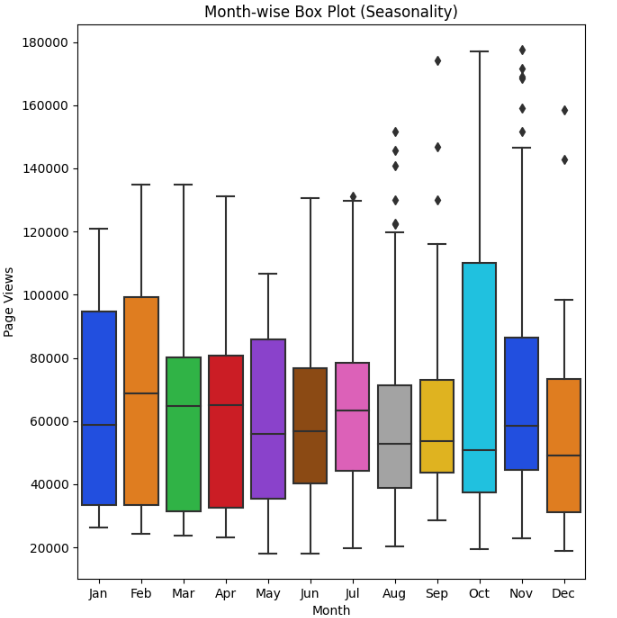
    </a>
      

        Good foundational hands-on knowledge of Data Analysis with Python. 
        From loading and cleaning flat files with Pandas to performing mathematical operations and statistical analysis with Numpy, 
        I also created diverse visualizations using Matplotlib and Seaborn.
        Note that instead of using Replit, I developed, debugged and validated the python modules for each problem using VS Code in my local machine.

      

  <h2 id="test" style = "clear : both; "></h2>
 
  
<strong><a href="https://github.com/GBlanch/SQL-weekly-challenges/tree/main#readme">SQL weekly case studies</a></strong>

  

      <a href="https://github.com/GBlanch/SQL-weekly-challenges/tree/main#readme">
          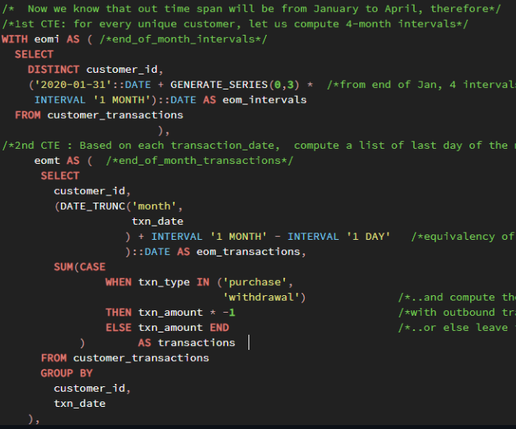
      </a>
      

          In this repository, I responded to the questions of the study cases of the course <em>8 week SQL challenge</em> by <em>Danny Ma</em>. 
          From essential SQL syntax to the elaboration of more intricate structures compound by CTEs, window functions and recursive queries, 
          these challenges were a splendid way to solidify the hands-on core knowledge in SQL.
      

  

  

  <h2 id="test" style = "clear : both; "></h2>
 
  
<strong><a href="https://github.com/GBlanch/Python-with-BeautifulSoup-for-Web-Scraping/tree/main">Web Scraping</a></strong>

  

    <a href="https://github.com/GBlanch/Python-with-BeautifulSoup-for-Web-Scraping/tree/main">
      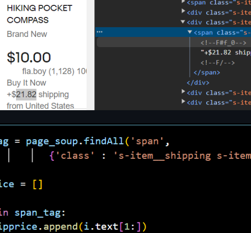
    </a>
      

        The purpose of this repository is to showcase some examples of Web Scraping I created by utilizing Python with BeautifulSoup. 
        I explain how to spot and parse the information from a HTML script in our browser Inspector, 
        so that we can fetch it into csv/tsv flat files or more structured files like jsons.
        Some of its preferable practices are also detailed along the narration of this repo's markdown file. 

      

    

    
  <h2 id="test" style = "clear : both; "></h2>
 
  
<strong><a href="https://github.com/GBlanch/Dashboard-works/blob/main/README.md">Dashboard works</a></strong>

  

    <a href="https://github.com/GBlanch/Dashboard-works/blob/main/README.md">
      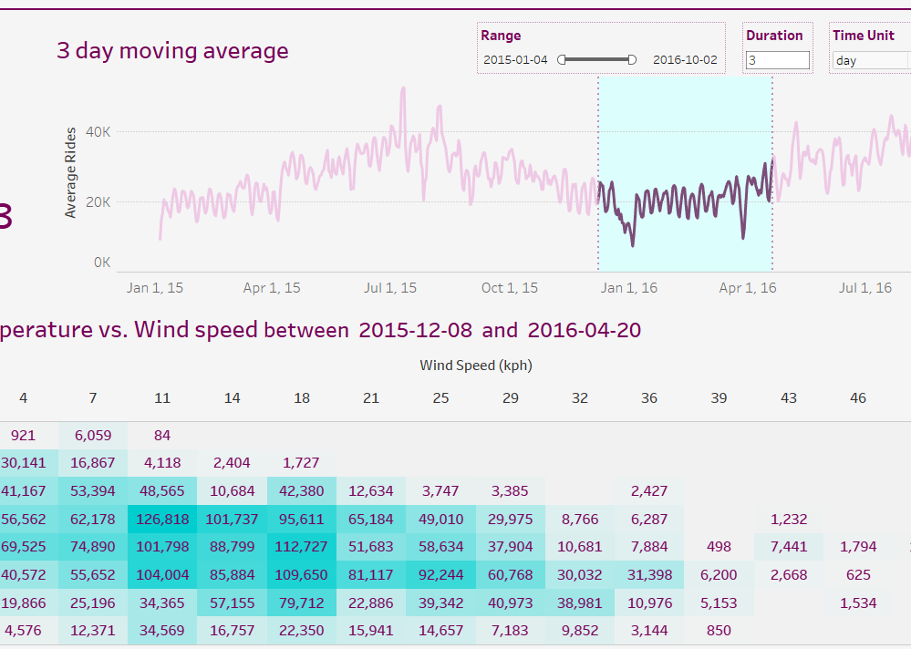
    </a>
      

        In this repo, I showcase some of the off-work dashboard creations I elaborated so far using mainly Tableau. The common denominator of these micro-projects is the use of 
        Data blending, LOD expressions, Calculated fields, Bin creation and Tooltip customization, amongst others. 
        You also can directly take a look at my <a href="https://public.tableau.com/app/profile/gerard.blanch/vizzes" target="_self" rel="noopener noreferrer" ><b>Tableau public profile</b></a> instead of checking out my GitHub repository.
        

     

  

  <h2 id="test" style = "clear : both; "></h2>
  

  
  <h3 id="data-engineering">Data <strong>Engineering</strong></h3>

  
<strong><a href="https://github.com/GBlanch/GCP-Uber-Data-Engineering-project">GCP Uber end-to-end pipeline</a></strong>

  

    <a href="https://github.com/GBlanch/GCP-Uber-Data-Engineering-project">
      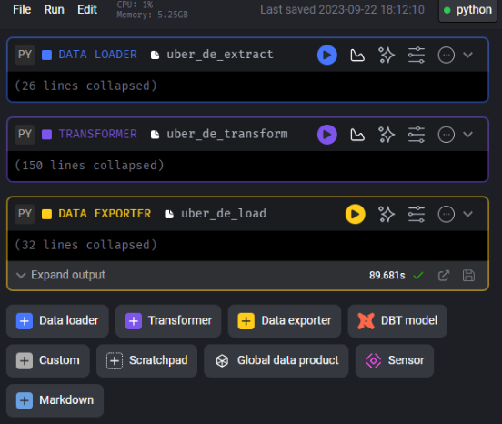
    </a>
      

       In this project, I designed and detailed the core stages of an end-to-end data pipeline using Google Cloud Platforms as the main resource/service provider. 
       This was an excellent occasion to review key notions on Data modeling. The orchestration of the ETL process was executed with Mage.

      

 

  <h2 id="test" style = "clear : both; "></h2>

  
<strong><a href="https://github.com/GBlanch/Azure-Tokyo-Olympics-Data-Engineering-project">Azure Tokyo Olympics end-to-end pipeline</a></strong>

  

    <a href="https://github.com/GBlanch/Azure-Tokyo-Olympics-Data-Engineering-project">
      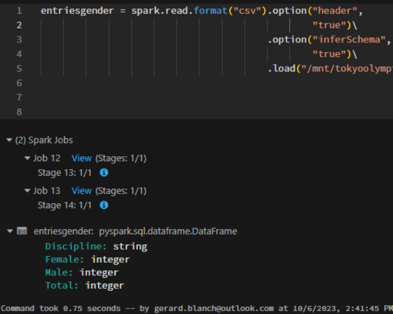
    </a>
      

        From data ingestion into Data Factory to a brief elaboration of some Charts and Graphs within Synapse Analytics, 
        in this project I elaborated an end-to-end data pipeline utilizing resources from Microsoft Azure. Apache Spark was employed for data processing. 

      

  <h2 id="test" style = "clear : both; "></h2>
   

  
<strong><a href="https://github.com/GBlanch/data-engineering-zoomcamp">DTC - Data Eng. Zoomcamp capstone project</a></strong>

  

    <a href="https://github.com/GBlanch/data-engineering-zoomcamp">
      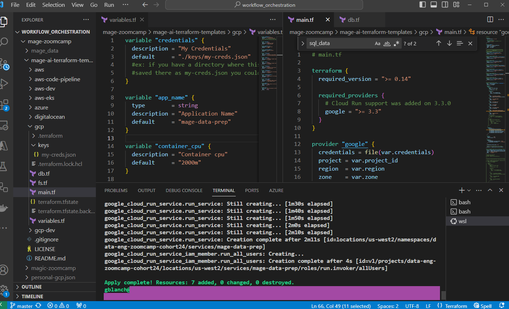
    </a>
      

        After brushing up hands-on concepts on Containerization, Workflow orchestration, Data warehousing and Analytics engineering,
        in the final section of this bootcamp I'm elaborating an end-to-end data pipeline with OLAP integration
        by means of Terraform as IaC and Cloud Run as serverless compute platform, amongst other frameworks and resources. 

      

  

<h2 id="test" style = "clear : both; "></h2>

<h3 id="data-science">Data <strong>Science</strong></h3>

<strong><a href="https://github.com/GBlanch/WorldQuant-University-Applied-DS-Lab/tree/main">WorldQuant University Applied DS Lab projects</a></strong>

</a></strong>

  <a href="https://github.com/GBlanch/WorldQuant-University-Applied-DS-Lab/tree/main">
  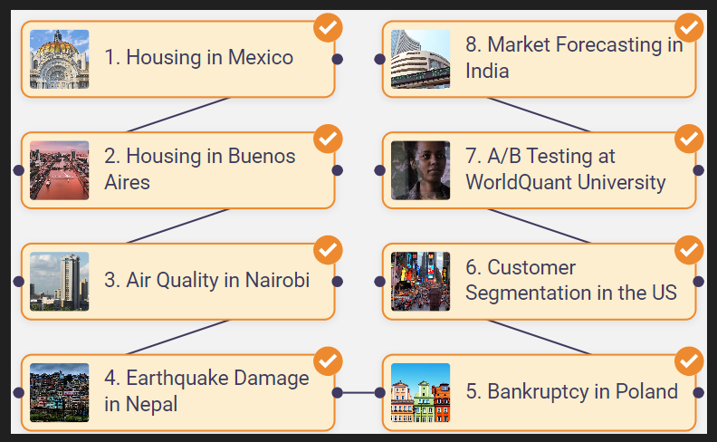
</a>

  In this repo, I summarized the syllabus of the hands-on courses in Data Science I took at WQU. 
  These were compound by 8 end-to-end DS micro-projects in which the common subjects were data ingestion from SQL/NoSQL databases and APIs, design of ETL pipelines, construction of supervised/unsupervised ML algorithms and web app design,
  development and deployment.

<h2 id="test" style = "clear : both; "></h2>
 

<strong><a href="https://github.com/GBlanch/fCC-Machine-Learning-with-Python-Certification">fCC Machine Learning challenges</Leg></a></strong>
 

  <a href="https://github.com/GBlanch/fCC-Machine-Learning-with-Python-Certification">
  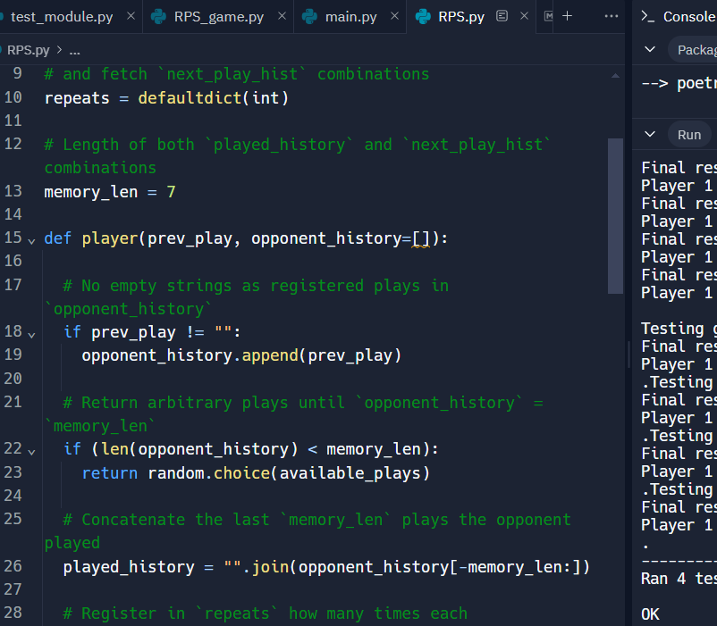
  </a>

  In this course, I employed TensorFlow framework to build several Neural Networks and explore more advanced techniques like Natural Language Processing and Reinforcement Learning. 
  That helped me learn the principles behind how deep, recurrent, and convolutional Neural Networks can operate. 
  Some of these micro-projects are <a href="https://github.com/GBlanch/fCC-Machine-Learning-with-Python-Certification/blob/main/2.book_recommendation_engine_using_knn/fcc_book_recommendation_knn_dec30.ipynb" target="_self" rel="noopener noreferrer" ><b>KNN Book Recommendation Engine</b></a>
  or <a href="https://github.com/GBlanch/fCC-Machine-Learning-with-Python-Certification/blob/main/4.neural_network_sms_text_classifier/fcc_sms_text_classification.ipynb" target="_self" rel="noopener noreferrer"><b>Neural Network SMS Text Classifier</b></a>
  , amongst others. 

<h2 id="test" style = "clear : both; "></h2>

<strong><a href="https://github.com/GBlanch/Student-Performance-Predictor/tree/main">End-to-End MLOps project  </Leg></a></strong>
 

  <a href="https://github.com/GBlanch/Student-Performance-Predictor/tree/main">
  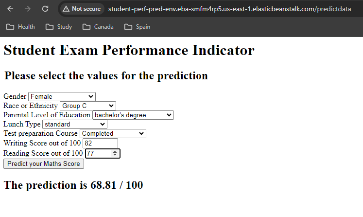
  </a>

  In this project, I created a web app to predict the performance of students based on their academic background and past results.
  Once the source code was locally built, tested and debugged in a conda development environment,
  then production deployment to Beanstalk was executed by means of CodePipeline.

<h2 id="test" style = "clear : both; "></h2>
 

<strong><a href="https://github.com/GBlanch/Statistical-Methods">Statistical Methods and ML essays</Leg></a></strong>

  <a href="https://github.com/GBlanch/Statistical-Methods">
  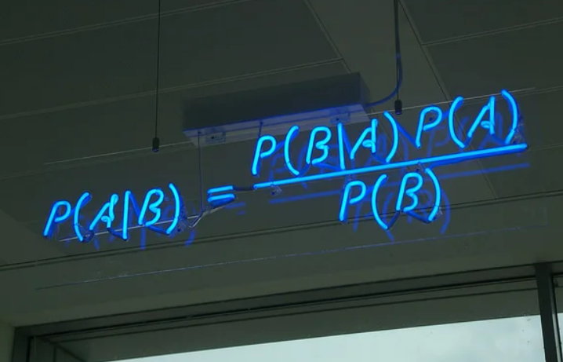
  </a>

  In this repository, I delve into some of the core concepts of Statistics and Probability I learned during my Bachelors of Science in Mechanical Engineering. 
  Without that essential knowledge, it would have been tougher to catch up with the most common methodologies and techniques utilized in Data Science, 
  and more particularly in the branch of Machine Learning. 
  Some of these subjects include:

</ul>
   
<ul>
  <ul>
    <li><a href="https://github.com/GBlanch/Statistical-Methods/blob/main/0.BGD%20for%20a%20Simple%20Linear%20Regression/Cost-Loss%20Funct.%20and%20BGD.ipynb">Batch Gradient Descent for a Simple Linear Regression</a></li>
    <li><a href="https://github.com/GBlanch/Statistical-Methods/blob/main/2.Expect.%E2%80%93Max.%20algorithm%20for%20GMMs/EM%20for%20GMM_2.ipynb">Expectation-Maximization algorithm for Gaussian Mixture Models</a></li>
    <li><a href="https://github.com/GBlanch/Statistical-Methods/blob/main/3.Stat._Hypoth._Testing_for_an_AB_Test/Stat._Hypoth._Testing_AB_Test.ipynb">Statistical Hypothesis Testing for an A/B Test</a></li>
    <li><a href="https://github.com/GBlanch/Time-Series-Cross-Validation-for-a-RR-model/blob/main/TSCV%20for%20a%20RR%20model.ipynb">Time-Series Cross-Validation for Ridge Regression Models</a></li>    
  </ul>
</ul>

<h2 id="test" style = "clear : both; "></h2>

<h2 id="academic-background">Academic background</h2>

<ul>
<h4 id="certificates">Certificates</h4>
  <ul>
  <li><a href="https://www.credly.com/org/amazon-web-services/badge/aws-certified-machine-learning-specialty">AWS - Certified Machine Learning - Specialty (CML)</a> ( in progress ) 
  <li><a href="https://www.credly.com/badges/7328a336-0942-4476-ad81-b7db5f1c1381/linked_in_profile">AWS - Certified Cloud Practitioner (CCP)</a> 
  <li><a href="https://github.com/GBlanch/Portfolio/blob/main/0.Files/1.Certificates/A.PMP/readme.md">PMI - Project Management Professional (PMP)</a></li>
  <li><a href="https://github.com/GBlanch/WorldQuant-University-Applied-DS-Lab#readme">WorldQuant University  - Applied Data Science Lab </a></li>
  <li><a href="https://github.com/GBlanch/fCC-Information-Security">freeCodeCamp - Information Security</a> ( in progress ) </a></li>
  <li><a href="https://github.com/GBlanch/fCC-Machine-Learning-with-Python-Certification/tree/main">freeCodeCamp - Machine Learning with Python</a></li>
  <li><a href="https://github.com/GBlanch/fCC-Data-Analysis-with-Python-Certification">freeCodeCamp - Data Analysis with Python</a></li>
  <li><a href="https://github.com/GBlanch/MongoDB-Python-Developer-Path/tree/main">MongoDB - Python Developer Path</a></li>
  <li><a href="https://www.hackerrank.com/certificates/f6d0cdc71c8a">HackerRank - SQL (Intermediate)</a></li>
  <li><a href="https://github.com/DataTalksClub/data-engineering-zoomcamp">DataTalks.Club - Data Engineering Zoomcamp</a> ( in progress )</a></li>
  <li><a href="https://github.com/GBlanch/Docker-Essentials-Developer-Introduction">IBM - Docker Essentials: A Developer Introduction</a></li>
  <li><a href="https://www.credly.com/badges/4378b6b3-0a2a-4aaf-96b1-f839fe201a63/linked_in_profile">IBM - Applied Data Science with Python</a></li>
  <li><a href="https://www.credly.com/badges/d320cd32-ac1c-4361-b6be-68a2dbf29e20/linked_in_profile">IBM - Data Science Foundations </a></li>
  <li><a href="https://www.credly.com/badges/8234bcee-2bd1-49df-960e-e7a03c95c058/linked_in_profile">IBM - R Essentials</a></li>
  <li><a href="https://www.credly.com/badges/2b2aebb3-836b-421b-b7f8-77d2186273e2/linked_in_profile">SAS - SAS Programming 1: Essentials</a></li>
  <li><a href="https://github.com/GBlanch/Portfolio/tree/main/0.Files/1.Certificates/2.LinkedIn~Microsoft/Tableau%20for%20Data%20Scientists">LinkedIn - Tableau for Data Scientists</a></li>
  <li><a href="https://github.com/GBlanch/Portfolio/blob/main/0.Files/1.Certificates/2.LinkedIn~Microsoft/readme.md">LinkedIn - Master Microsoft Excel</a></li>
  <li><a href="https://www.credly.com/org/isc2/badge/certified-in-cybersecurity-cc#:~:text=It%20proves%20to%20organizations%20that,a%20stronger%20line%20of%20defense.">ISC2 - Certified in Cybersecurity</a> ( in progress )</a></li>
  <li><a href="https://github.com/GBlanch/Portfolio/blob/main/0.Files/1.Certificates/2.LinkedIn~Microsoft/readme.md">Microsoft and LinkedIn - Career Essentials in Cybersecurity</a></li>
  <li><a href="https://github.com/GBlanch/Portfolio/blob/main/0.Files/1.Certificates/2.LinkedIn~Microsoft/readme.md">Microsoft and LinkedIn - Career Essentials in Data Analysis</a></li>

  
</ul>
  

  <h4 id="academic-transcripts">Transcripts</h4>

  <ul>
  <li><a href="https://github.com/GBlanch/Portfolio/tree/main/0.Files/A.Transcripts/0.WES%20Course-by-Course%20report">Bachelors of Science in Mech. Engineering and postgraduate in Renewable Energies</a></li>
  <li><a href="https://github.com/GBlanch/Portfolio/tree/main/0.Files/A.Transcripts/2.%20%E6%B1%89%E8%AF%AD%E6%B0%B4%E5%B9%B3%E8%80%83%E8%AF%95%20%EF%BC%88%E4%BA%8C%E7%BA%A7%EF%BC%89%20-%20HSK%202">中外语言交流合作中心 - 汉语水平考试 （二级) </a></li>
  </ul> 
  

